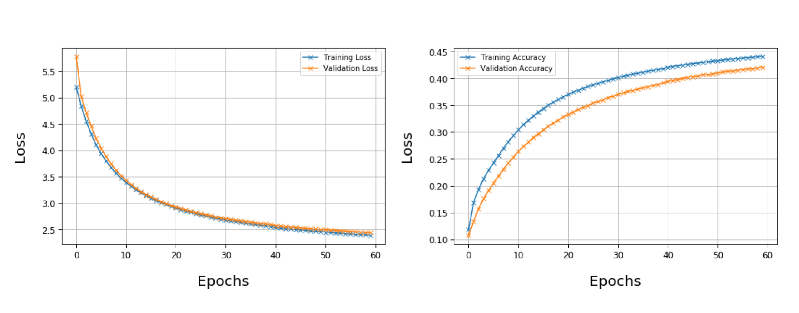

# GPT-GOT
A Long Short Term Memory trained with Games of Thrones books in PyTorch

## Working principle

- First we encode the entire vocabulary of words using Word2Vec which is provided as `word2vec.model`
- Recurrent Neural Networks (RNNs) are a family of neural networks specialized in processing a sequence of values (x1, . . . , xn). The strength of a RNN is that it shares its weights across the network and the output is a function of the previous output. The problem of RNN is that they suffer of short memory and if a sequence is long enough they have some troubles in processing it. During the back-propagation phase, the gradient tends to vanish throughout time and layers who get a small gradient stop learning. Long-Short Term Memory try to solve this problem using the so called cell gates which regulate the flow of information learning which elements of the sequence are important for future output predictions. When a sequence X of length N is passed to a RNN each element of the sequence is processed one by one, in our specific case, each element is an embedding vector created with Word2vec.

## Further specifications

- Long Short-Term Memory has been trained on the first two books of the Games of Thrones series. In order to build the dataset the punctuation has been retained and passed at Word2Vec. To enhance the capabilities of the network enlarging the dataset with the maintenance of the context of the two stories, given the whole corpus containing the two books, sentences are created with a window containing 30 words and with a slice of the window equal to 4. This process gives the opportunity to the network to see many times a slight variation of a phrase, obviously sentences are shuffled every epoch. The training set is composed by 155432 different sentences, while the Validation and the Test sets by 59953, 6662 sentences respectively. During the process of learning the loss and the accuracy are monitored over time looking at the validation set to avoid the overfitting.
- The embedding dimension has been set to 128 which comes from different tests looking at the cosine similarity of the encoded words, (e.g Daenerys is similar to Targaryen,Drogon,Cersei,Throne)
- The context window has been set to 8 as the default Word2Vec of the Gensim library works with CBOW, usual values for the context windows ranges from 5 to 10 as reported in the library
- To improve Word2Vec capabilities a negative sampling of words for each input value is passed to the network, the aim of this technique is to maximize the similarity of the target word, context word pairs minimizing the similarity of the pairs drawn from the negative data at the same time. The number of epochs required to train Word2Vec is about 20 with no significant improvement for higher epochs
- The network is composed by three stacked LSTM each one with 512 hidden units in the hidden layer. Each of the 3 blocks architectures is build with the embedding layer, the LSTM layer and a Dense layer which will be passed to the softmax function. As for Word2Vec the parameters has been selected according to the existing networks and literature in order to find a trade-off between the performance, the complexity of the network and the training time.
- RMSprop has been selected as optimizer, which adapts the learning rate during the process of learning. The SGD optimizer has been tested resulting in a very slow training convergence.


## Usage

**NB:** Since network weights are too large you will need to retrain the LSTM (quite long without an appropriate hardware)

in the `traine_model.py` you can select the following:

- `word2vec = False`, if true it start training the network to learn the embeddings 
- `pretrain = True`, if true it loads existing Word2Vec model
- `training = False`, if true it starts training the LSTM network
- `testing = True`, if true it run a test with a seed decided by the user. To test the model run

```
python trained_model.py --seed "Hello brother" --length 50
```
where length is the maximum length of the output produced by the network. 

## Results 

Here we provide a simple statistical result of our model

